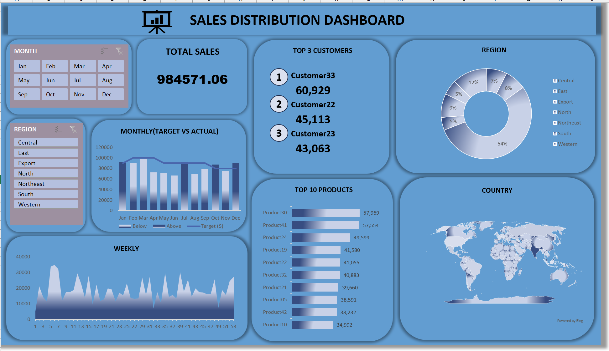

# Sales Distribution Dashboard

## 📊 Project Overview

This project presents an interactive Sales Distribution Dashboard developed in Microsoft Excel to analyze sales performance across customers, products, regions, countries, and time periods.

The dashboard consolidates key sales metrics into a single interactive view, enabling users to monitor overall performance, compare actual sales against targets, identify top-performing customers and products, and analyze regional sales trends.

## 🎯 Business Objective

The objective of this project is to provide a centralized view of sales performance that helps business stakeholders monitor results, identify growth opportunities, and detect areas requiring attention.

The dashboard is designed to support the following business decisions:

- Monitor overall sales performance
- Compare actual sales against monthly targets
- Identify high-value customers
- Identify top-performing products
- Evaluate sales contribution across regions and countries
- Analyze sales trends over time
- Identify periods of strong and weak performance
- 
## 🛠️ Tools & Technologies

- Microsoft Excel
- Pivot Tables
- Pivot Charts
- Slicers
- Excel formulas
- Data Visualization
- KPI Analysis

## 📈 Dashboard Features

The dashboard provides a consolidated view of sales performance through the following analytical components:

### Key Performance Indicators

- **Total Sales** – Overall sales generated across the dataset
- **Top 3 Customers** – Customers contributing the highest sales
- **Top 10 Products** – Best-performing products based on sales
- **Regional Sales Distribution** – Comparison of sales contribution across regions

### Trend & Performance Analysis

- **Monthly Target vs Actual Sales** – Comparison of actual sales performance against monthly targets
- **Weekly Sales Trend** – Analysis of sales movement across weeks
- **Country-wise Sales Distribution** – Geographic view of sales contribution

### Interactive Filters

Users can filter the dashboard using:

- **Month**
- **Region**

These filters allow users to explore different segments of the sales data dynamically.

### Interactive Filters

The dashboard includes interactive filters for:

- Month
- Region

These filters allow users to dynamically explore sales performance.

## 🖼️ Dashboard Preview

## 🔍 Key Business Questions

This dashboard helps answer questions such as:

1. What are the total sales?
2. Which customers generate the highest sales?
3. Which products are performing the best?
4. Which regions contribute the most to sales?
5. How does actual sales performance compare with targets?
6. How do sales fluctuate throughout the year?
7. Which countries contribute to overall sales?

## 💡 Key Insights

Based on the dashboard:

- Total sales are approximately **984.57K**.
- Customer33 is the highest-performing customer among the displayed top customers.
- Customer22 and Customer23 are the next two leading customers.
- Product30 is the highest-performing product among the displayed top 10 products.
- Regional sales distribution shows significant variation across regions.
- Monthly target vs actual analysis highlights periods of both underperformance and overperformance.

## 📂 Project Files

| File | Description |
|---|---|
| `Sales_Distribution_Dashboard.xlsx` | Excel dashboard |
| `Dashboard_Preview.png` | Dashboard preview |

## 📚 Skills Demonstrated

- Data Cleaning
- Data Analysis
- Excel Dashboard Development
- KPI Development
- Data Visualization
- Sales Performance Analysis
- Business Intelligence
- Interactive Reporting

## 👨‍💻 Author

Akash

Aspiring Data Analyst focused on transforming data into actionable business insights.
